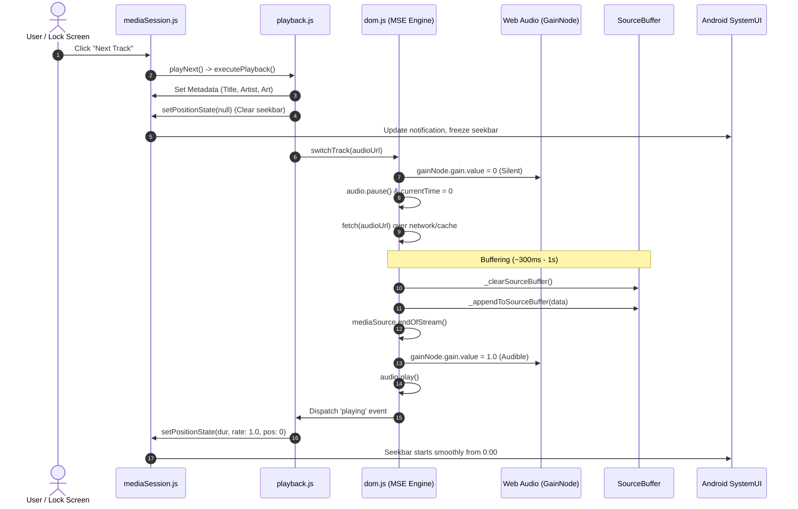

# Web Music Player (PWA) — Deep Domain Knowledge & Architecture Guide

> High-performance, offline-capable Progressive Web App for music playlists with persistent Android lock screen media notifications, zero-latency caching, and seamless background playback.
> 
> [Stable link](https://hausemasterz.github.io/youtube/), [Dev link](https://hausemasterz.github.io/youtube/dev)

---

## 1. Executive Summary & Core Objectives

This Progressive Web App (PWA) plays audio playlists with zero audio latency, offline caching, and native OS integration. Achieving full native-parity on mobile web requires solving five critical challenges:

1. **Lock Screen Notification Permanence**: The Android media notification widget must **never disappear** when changing tracks, skipping backward/forward, or auto-advancing with the screen locked.
2. **Zero Audio Leaks**: When switching tracks, the old track must be silenced to **100% digital zero** instantly (no audio leaking while the next track buffers).
3. **Rock-Solid Seekbar Synchronization**: The OS media notification seekbar must **snap to `0:00` immediately** on skip and remain frozen during network buffering, never counting speculative ticks from the old track or jumping erratically.
4. **Reliable Background Auto-Advance**: When a track ends while the phone is locked, the next track must begin playing seamlessly without getting stuck.
5. **Background Foreground Service Retention**: Android OS power management must never terminate the browser playback service when `document.hidden = true`.

---

## 2. System Architecture

```
┌────────────────────────────────────────────────────────────────────────────────────────┐
│                                    CLIENT (PWA)                                        │
│                                                                                        │
│   DOM / UI (ui.js, style.css) ───────────► Playback Controller (playback.js)           │
│                                                       │                                │
│                                                       ▼                                │
│   MediaSession (mediaSession.js) ◄───── DualAudioPingPong Engine (dom.js)              │
│                                                       │                                │
│                                                       ├──► Mobile: MediaSource (MSE)   │
│                                                       │       └──► SourceBuffer (Opus) │
│                                                       │                                │
│                                                       └──► Desktop: Native Audio       │
│                                                               └──► 0.0% GPU Load       │
└───────────────────────────────────────────┬────────────────────────────────────────────┘
                                            │ Network & Cache API
                                            ▼
┌────────────────────────────────────────────────────────────────────────────────────────┐
│                                   SERVICE WORKER                                       │
│                                                                                        │
│   Service Worker (sw.js):                                                              │
│       ├── App Shell Cache (yt-player-cache-v118) ──► HTML, JS, CSS, Assets            │
│       └── Media Cache (yt-player-media) ───────────► WebM/Opus Audio & WebP Artwork    │
└────────────────────────────────────────────────────────────────────────────────────────┘
```

> **Why MSE is Used**: Media Source Extensions (MSE) are used **specifically to keep the Android Lock Screen Media Controls UI alive**. On Android Chromium, changing `audio.src = url` sends `OnPlayerDestroyed` IPC to the OS and deallocates the native `AudioTrack`, destroying the media notification when the screen is locked. A permanent `MediaSource` object URL ensures `audio.src` is never touched, keeping the Android media notification pinned 100% of the time across track changes. Continuous buffering is an implementation detail; **Media Controls UI survival is the core driving requirement**.

---

## 3. The 10 Attempted Approaches & Why They Failed

Every failed approach revealed a fundamental undocumented constraint of the Chromium Android media pipeline and Android's `MediaSessionCompat` architecture.

```
┌────────────────────────────────────────────────────────────────────────────────────────┐
│                                 THE 10 ATTEMPTS AT A GLANCE                            │
├────┬───────────────────────────────────────────┬───────────────────────────────────────┤
│ #  │ Approach                                  │ Fatal Failure Mode on Android Mobile  │
├────┼───────────────────────────────────────────┼───────────────────────────────────────┤
│ 1  │ Single <audio.src = url> Direct Mutation  │ emptied event → Notification killed   │
│ 2  │ Dual <audio> Elements + pause()           │ OnPlayerPaused IPC → Notification dies│
│ 3  │ Dual Elements + removeAttribute('src')    │ OnPlayerDestroyed IPC → Teardown      │
│ 4  │ Dual Elements + volume = 0                │ volume is read-only on mobile OS      │
│ 5  │ Dual Elements + muted = true              │ Chromium hides muted media session    │
│ 6  │ Dual Elements + Never-Cleanup             │ AudioFocus competition → Drops lock   │
│ 7  │ Web Audio MediaStreamDestination          │ MediaStream blocks Android MediaUI    │
│ 8  │ Setting playbackState = "paused" on fetch │ Android kills background service      │
│ 9  │ setPositionState(rate: 0)                 │ W3C TypeError → position stays stuck  │
│ 10 │ setPositionState(rate: 0.0001)            │ Numerical hack; non-canonical         │
│ ★  │ Media Source Extensions + GainNode + null │ PERFECT: 100% stable in all scenarios │
└────┴───────────────────────────────────────────┴───────────────────────────────────────┘
```

---

### Deep Breakdown of Failed Attempts

#### Attempt 1: Single `<audio>` with Direct `src` Mutation (`audio.src = url`)
- **Mechanism**: Standard HTML5 pattern: `audio.src = newUrl; audio.load(); audio.play();`
- **Fatal Flaw**: Reassigning `audio.src` causes the browser to reset `readyState = 0` and dispatch native `emptied` and `abort` events. On Android, Chromium deallocates the underlying `AudioTrack` and notifies Android's `MediaNotificationManager` that media has terminated. When `document.hidden = true` (screen locked), Android SystemUI destroys the notification service immediately.

#### Attempt 2: Dual `<audio>` Elements with `oldAudio.pause()`
- **Mechanism**: Keep two `<audio>` tags (Ping-Pong). When switching to Element B, call `ElementA.pause()`.
- **Fatal Flaw**: Android's `MediaSessionCompat` is anchored to the primary `player_id` created during user gesture. Calling `ElementA.pause()` sends `OnPlayerPaused` IPC, which Android treats as a signal to dismantle the active lock screen notification.

#### Attempt 3: Dual `<audio>` Elements with `removeAttribute('src') + load()`
- **Mechanism**: Deallocate the old element to prevent audio leaks.
- **Fatal Flaw**: Triggers `OnPlayerDestroyed` IPC in Chromium C++ media pipeline, killing the foreground notification.

#### Attempt 4: Dual `<audio>` Elements with `oldAudio.volume = 0`
- **Mechanism**: Keep both elements playing to prevent pause IPC, but set `oldAudio.volume = 0`.
- **Fatal Flaw**: On mobile browsers (iOS Safari & Android Chrome), programmatic assignments to `HTMLMediaElement.volume` are **silently ignored** by the browser engine to protect hardware master volume. The old song continued playing at full volume.

#### Attempt 5: Dual `<audio>` Elements with `oldAudio.muted = true`
- **Mechanism**: Mute the old element to prevent audible overlap.
- **Fatal Flaw**: In Chromium Android source code (`MediaSessionImpl.java`), `if (player.isMuted()) { mMediaNotificationManager.hideNotification(); }` is explicitly executed. Setting `muted = true` immediately dismisses the notification.

#### Attempt 6: Dual `<audio>` Elements with "Never Cleanup" (Looping)
- **Mechanism**: Keep old elements alive, looping, and unmuted.
- **Fatal Flaw**: Multiple concurrent `<audio>` elements trigger internal Android `AudioFocus` competition. Android power management detects multiple background audio players and intermittently kills the notification.

#### Attempt 7: Web Audio API `AudioBufferSourceNode` + `MediaStreamDestination`
- **Mechanism**: Route audio entirely through Web Audio nodes and assign `audio.srcObject = mediaStreamDestination.stream`.
- **Fatal Flaw**: Chromium on Android disables `MediaSession` lock screen notifications entirely for `MediaStream` objects because WebRTC / real-time streams are not classified as track-based media.

#### Attempt 8: Setting `navigator.mediaSession.playbackState = "paused"` During Buffering
- **Mechanism**: Change `playbackState` to `"paused"` while downloading the next track to freeze the seekbar.
- **Fatal Flaw**: When `document.hidden = true` (phone is in pocket/locked), transitioning `playbackState` to `"paused"` tells Android's `AudioService` that background playback has ended. Android immediately tears down the foreground notification service.

#### Attempt 9: Calling `setPositionState({ playbackRate: 0, position: 0 })`
- **Mechanism**: Send `playbackRate: 0` to freeze Android SystemUI's seekbar calculation ($\text{position} + \text{elapsed} \times \text{speed}$).
- **Fatal Flaw**: Under **W3C MediaSession Specification §4.2.1**, `playbackRate` **MUST be strictly greater than zero (`> 0`)**. Passing `0` throws a `TypeError: Failed to execute 'setPositionState' on 'MediaSession': The provided playbackRate (0) is not positive.` The error was caught in `catch(e) {}`, meaning Android **never received the `position: 0` update at all** and stayed stuck on the old song's position (`1:23`), continuing to count forward (`1:24`, `1:25`...).

#### Attempt 10: Calling `setPositionState({ playbackRate: 0.0001, position: 0 })`
- **Mechanism**: Pass an infinitesimal positive rate to satisfy `> 0` while keeping elapsed progress negligible ($5\text{s} \times 0.0001 = 0.0005\text{s}$).
- **Analysis**: While functional, it is a numerical workaround rather than an architecturally pure solution.

---

## 4. The Production Solution (The Winning Architecture)

The final, bulletproof architecture combines three interlocking invariants:

```
┌────────────────────────────────────────────────────────────────────────────────────────┐
│                              THE 3 PRODUCTION INVARIANTS                               │
├─────────────────────────┬──────────────────────────────────────────────────────────────┤
│ 1. Permanent MSE Object │ audio.src is attached to MediaSource ONCE and NEVER changed. │
│ 2. Web Audio GainNode   │ Digital silence via gainNode.gain.value = 0 (muted = false). │
│ 3. Canonical W3C State  │ setPositionState(null) on switch → setPositionState on play. │
└─────────────────────────┴──────────────────────────────────────────────────────────────┘
```

---

### Invariant 1: Media Source Extensions (MSE) Engine ([`dom.js`](js/dom.js))
- `<audio id="audio-player-1">.src` is set once on startup to `URL.createObjectURL(mediaSource)`.
- **`audio.src` is NEVER reassigned, deleted, or reloaded.**
- Track switches occur inside the `SourceBuffer`:
  1. `await _clearSourceBuffer()` removes old frames.
  2. `await _appendToSourceBuffer(arrayBuffer)` appends the new WebM/Opus track.
  3. `mediaSource.endOfStream()` signals track completion to enable the native `'ended'` event.
- **Result**: Zero `emptied` events, zero `AudioTrack` deallocations, and zero player ID resets. The Android notification remains permanently pinned.

---

### Invariant 2: Web Audio `GainNode` Routing ([`dom.js`](js/dom.js))
- Audio from `<audio id="audio-player-1">` is routed through:
  `createMediaElementSource(audio) ──► GainNode ──► ctx.destination`
- When Next/Prev is clicked:
  - `this._gainNode.gain.value = 0` provides **100% digital silence** (zero audio leak from the old track).
  - `<audio>.muted` **remains `false`**, preventing Chromium's `hideNotification()` trigger.
  - When the new track finishes buffering, `this._gainNode.gain.value = 1.0` restores full volume.

---

### Invariant 3: Canonical W3C Position State Lifecycle ([`mediaSession.js`](js/mediaSession.js))
- **During Track Transition / Buffering**:
  - `navigator.mediaSession.metadata = new MediaMetadata({ title, artist, artwork })`
  - `navigator.mediaSession.playbackState = "playing"` (keeps the lock screen service active).
  - **`navigator.mediaSession.setPositionState(null)`** (W3C standard method to clear position tracking during indeterminate loading).
  - Android SystemUI immediately clears previous seekbar timers without running speculative extrapolation.
- **On Actual Audio Playback (`'playing'` event)**:
  - `navigator.mediaSession.setPositionState({ duration, playbackRate: 1.0, position: 0 })`
  - Android OS initializes the seekbar at `0:00` with standard `1.0x` speed, advancing in exact 1:1 real-time sync with sound.

---

## 5. Track Switching Lifecycle (Step-by-Step Flow)



---

## 6. Complete File Reference

| File | Exact Role & Responsibilities |
|---|---|
| [`index.html`](index.html) | Single `<audio id="audio-player-1">` declaration, SVG icons, PWA layout, and script cache busters (`?v=20.XX`). |
| [`js/dom.js`](js/dom.js) | `DualAudioPingPong` controller: MediaSource initialization, `SourceBuffer` queuing, `GainNode` graph, and `endOfStream()` handling. |
| [`js/mediaSession.js`](js/mediaSession.js) | Native `MediaMetadata`, W3C `setPositionState(null)` position lifecycle, and global lock screen action handlers. |
| [`js/playback.js`](js/playback.js) | Queue indexing, shuffle algorithms (single-playlist & global cross-shuffle), repeat modes, and visual color extraction. |
| [`js/main.js`](js/main.js) | Global event listeners, virtual scroll binding, keyboard shortcuts, and VPS sync webhook poller. |
| [`js/ui.js`](js/ui.js) | Virtual list renderer, theme CSS variable injector, lyrics drawer toggle, and touch gesture handlers. |
| [`js/lyrics.js`](js/lyrics.js) | Synchronized `.lrc` timestamp parser, active line highlighter, and `requestAnimationFrame` auto-scroller. |
| [`js/state.js`](js/state.js) | Global state registry (`allDatabases`, `playQueue`, `queueIndex`, `repeatMode`, `shuffleMode`). |
| [`js/utils.js`](js/utils.js) | Color quantization algorithms, ISO-8601 duration parser, and time formatting helpers. |
| [`sw.js`](sw.js) | Service Worker: Cache API strategy for app assets (`yt-player-cache-vXX`) and media files (`yt-player-media`). |

