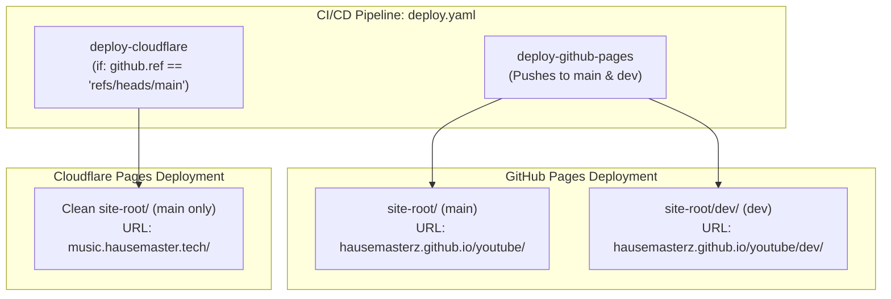

# Branch Routing Implementation Plan

> **For agentic workers:** REQUIRED SUB-SKILL: Use superpowers:subagent-driven-development to implement this plan task-by-task. Steps use checkbox (`- [ ]`) syntax for tracking.

**Goal:** Implement a dual-target CI/CD deployment pipeline in `youtube_frontend` so that the `dev` branch is hosted under GitHub Pages at `https://hausemasterz.github.io/youtube/dev/` and the `main` branch is hosted on Cloudflare Pages at `https://music.hausemaster.tech` (with `https://hausemasterz.github.io/youtube/` as the root GitHub Pages fallback).

**Architecture:** Split the deployment workflow in `.github/workflows/deploy.yaml` into two decoupled, dedicated jobs. The GitHub Pages job checks out both `main` and `dev` to produce a nested hierarchy (`site-root/` and `site-root/dev/`) with isolated Service Worker cache namespaces, running on every push to satisfy GitHub ruleset checks (`GH013`). The Cloudflare Pages job runs strictly when `github.ref == 'refs/heads/main'` with a clean, single checkout of `main` without staging files, deploying directly to the custom domain.

**Architecture Diagram:**



**Tech Stack:** GitHub Actions, Node.js LTS, terser, html-minifier-terser, clean-css-cli, Cloudflare Wrangler CLI, GitHub Pages deploy action.

## Global Constraints
- Strictly ZERO EMOJIS across all code, comments, commit messages, and documentation.
- Maintain 100% test pass rate across all 156 pytest unit tests.
- Ensure all asset references remain relative for multi-level directory execution.

---

### Task 1: Refactor `.github/workflows/deploy.yaml` for Dual-Target Pipeline

**Files:**
- Modify: `.github/workflows/deploy.yaml`

**Interfaces:**
- Input: GitHub push events on `main` and `dev`.
- Output: 
  - `built-distribution` artifact with `site-root/` and `site-root/dev/` for GitHub Pages.
  - Dedicated Cloudflare Pages deployment step strictly targeting `main`.

- [ ] **Step 1: Update Job 1 (`build-github-pages`) for Dual-Checkout and Isolated Minification**
  - Checkout `ref: main` to `site-root`.
  - Checkout `ref: dev` to `dev-src`.
  - Merge `dev-src` into `site-root/dev/` (excluding `.git` and `.github`).
  - Minify both `site-root` and `site-root/dev`.
  - Set `CACHE_NAME` to `yt-player-cache-main-<sha>` for root and `yt-player-cache-dev-<sha>` for `/dev/`.
  - Upload artifact for GitHub Pages.

- [ ] **Step 2: Update Job 2 (`deploy-github-pages`)**
  - Deploys the built distribution artifact to GitHub Pages.
  - Uses `environment: github-pages`.

- [ ] **Step 3: Update Job 3 (`deploy-cloudflare`)**
  - Add condition: `if: github.ref == 'refs/heads/main'`
  - Single checkout of `ref: main` to `cf-root`.
  - Minify root assets for Cloudflare.
  - Deploy via Wrangler with `--branch=main` and `--commit-dirty=true`.

- [ ] **Step 4: Run local unit tests**
  - Command: `pytest tests/`
  - Expected: 156 passed in < 1.0s.

- [ ] **Step 5: Commit changes to `dev`**
  - Command: `git add .github/workflows/deploy.yaml && git commit -m "ci: configure dual-target deployment for dev and main branches"`

---

### Task 2: Push to `dev`, Merge to `main`, and Verify Live Endpoints

**Files:**
- Remote: GitHub repository `HauseMasterZ/youtube`
- Remote: Cloudflare Pages `music-player-web`

- [ ] **Step 1: Push commit to `origin/dev`**
  - Command: `git push origin dev`
  - Verify GitHub Actions run triggers and completes `deploy-github-pages` while skipping `deploy-cloudflare`.

- [ ] **Step 2: Verify `https://hausemasterz.github.io/youtube/dev/`**
  - Command: `curl -sI https://hausemasterz.github.io/youtube/dev/`
  - Expected: `HTTP/1.1 200 OK`
  - Verify HTML body contains PWA markup.

- [ ] **Step 3: Merge `dev` into `main` and push to `origin/main`**
  - Commands:
    ```powershell
    git checkout main
    git merge dev --allow-unrelated-histories -X theirs -m "Merge dev into main for production custom domain deployment"
    git push origin main
    ```
  - Verify GitHub Actions run triggers and executes both `deploy-github-pages` and `deploy-cloudflare`.

- [ ] **Step 4: Verify `https://music.hausemaster.tech` and `https://hausemasterz.github.io/youtube/`**
  - Command: `curl -sI https://music.hausemaster.tech`
  - Expected: `HTTP/1.1 200 OK` (Server: cloudflare)
  - Command: `curl -sI https://hausemasterz.github.io/youtube/`
  - Expected: `HTTP/1.1 200 OK` (Server: GitHub.com)
